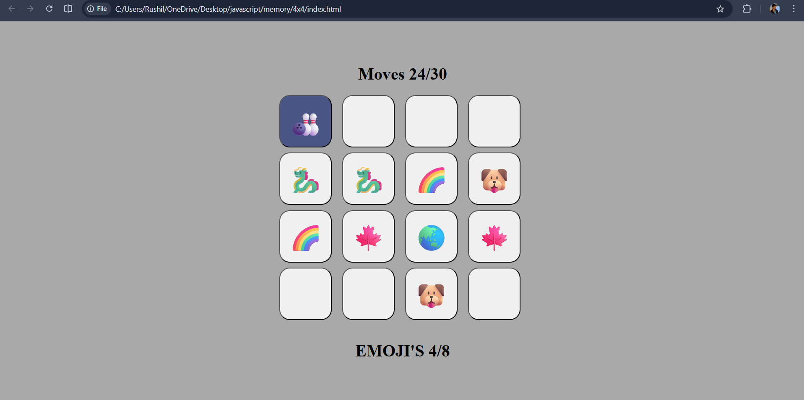

# Memory-Game
Made from html, css and javascript. it is a card flip memory game. 

Link : https://rushil1310.github.io/Memory-Game/

## Rules
Click on any 2 random cards. After that you need to remember what is under the card. You will get a total of 30 choices 15 pairs of cards will be shown. And you need to find all 8 pair of emojis out of those.
The emojis will change on every game so if you loose you can't repeat your game.

Good luck playing I hope you win!

## Image 

